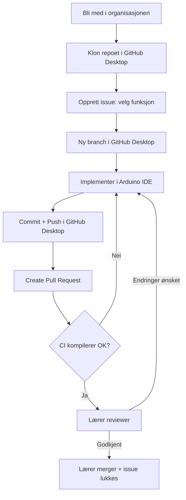

# GitHub-oppsett for organisasjonen (lærer, gjøres én gang)

Denne filen dekker det som er spesifikt for at klassen jobber i en **GitHub Organization** (en delt konto som eier repoet, der elevene er medlemmer) med **GitHub Desktop**, i tillegg til det som allerede står i [LARERPROSEDYRE.md](LARERPROSEDYRE.md). Gjør disse stegene *før* elevene starter.

## 0. Kopier repoet til din egen organisasjon

### Opprett en organisasjon (hvis du ikke har en fra før)

1. Logg inn på github.com, trykk profilbildet ditt øverst til høyre → **Your organizations** → **New organization**.
2. Velg planen **Free** (den dekker det dette opplegget trenger).
3. Gi organisasjonen et navn (f.eks. `dittskolenavn-klasse`), fyll inn resten og trykk **Create organization**. Du kan legge til elever som medlemmer senere (se steg 1 under).

### Kopier selve repoet inn i organisasjonen

1. Gå til det originale repoet: [github.com/FreyBear/klokkeprosjekt](https://github.com/FreyBear/klokkeprosjekt).
2. Trykk **Use this template → Create a new repository** øverst på siden *(hvis knappen ikke vises, bruk **Fork** øverst til høyre i stedet)*.
3. Under "Owner", velg din egen organisasjon (ikke din private konto).
4. Gi repoet et navn, velg **Private** (anbefalt for elevarbeid), og trykk **Create repository**.
5. Klon *din* nye kopi i GitHub Desktop (**File → Clone repository**) — ikke det originale repoet.

Alle filene som beskriver opplegget (README, ELEVOPPGAVER, LARERPROSEDYRE, denne filen, issue- og PR-malene og CI-sjekken i `.github/`) følger automatisk med kopien, og fungerer med det samme i din egen organisasjon.

## 1. Legg elevene inn i organisasjonen

1. Gå til organisasjonens side på github.com → **People** → **Invite member**.
2. Inviter med e-postadresse eller GitHub-brukernavn. Elevene må godta invitasjonen (sjekk e-post/varsel på github.com).
3. *(Valgfritt, men anbefalt for større klasser)* Lag et **Team** (Organization → Teams → New team), f.eks. `klasse-YY`, og legg alle elevene i det. Da kan du gi hele klassen tilgang til repoet i ett steg i stedet for én og én.

## 2. Gi riktig tilgang til repoet

Elevene jobber **direkte med branches i hovedrepoet** (ikke forks) slik README beskriver, så de trenger **Write**-tilgang for å kunne pushe branches og opprette PR-er:

1. Repoet → **Settings → Collaborators and teams**.
2. Legg til teamet `klasse-YY` (eller enkeltelever) med rolle **Write**.
3. La deg selv (lærer) ha **Admin** for å kunne endre branch protection og merge PR-er.

> Elever med kun **Read**-tilgang kan ikke pushe branches — da må de forke repoet i stedet, som er en unødvendig ekstra kompleksitet for dette opplegget.

## 3. Beskytt `main`-branchen

Repoet → **Settings → Branches → Add branch ruleset/rule** for `main`:

- ✅ **Require a pull request before merging** — ingen kan pushe rett til `main`, heller ikke ved uhell.
- ✅ **Require status checks to pass before merging** → velg sjekken **`compile`** (fra GitHub Actions-workflowen `Build Sketch`, se under). Da kan ikke en PR merges før koden faktisk kompilerer.
- Valgfritt: **Require approvals** (1) hvis du vil ha eksplisitt godkjenning i tillegg til status-sjekken.
- La **Include administrators** stå av hvis du selv iblant trenger å pushe direkte (f.eks. rydding), ellers på for maks konsistens.

## 4. Automatisk kompilerings-sjekk (GitHub Actions)

Repoet har allerede en ferdig workflow: [.github/workflows/build.yml](.github/workflows/build.yml). Den kjører automatisk `arduino-cli compile` på hver PR og på push til `main`, og viser ✅/❌ direkte på PR-siden — ingen ekstra oppsett nødvendig utover å velge den som required status check i steg 3. Dette gjør sjekklistepunktet "Kompilerer koden?" i [LARERPROSEDYRE.md](LARERPROSEDYRE.md) automatisk, i tillegg til den manuelle testen på egen maskin.

> **OBS ved `paths-ignore`:** Workflowen hopper over rene `.md`-endringer for å spare byggetid. Hvis du har satt `compile` som required status check og en PR *kun* endrer `.md`-filer, kan GitHub vise sjekken som "venter" for alltid siden den aldri kjøres — merge blokkeres da til du enten legger til en ikke-.md endring i PR-en, eller (i Settings → Branches) skrur på **"Require branches to be up to date"**/bruker en fallback-jobb. I praksis skjer dette sjelden, siden elevene alltid endrer `sketch/sketch.ino`.

## 5. Sett opp "velg funksjon"-oversikten som Issues

I stedet for et regneark eller en tavle i klasserommet: repoet har en ferdig **issue-mal** ([.github/ISSUE_TEMPLATE/velg-funksjon.md](.github/ISSUE_TEMPLATE/velg-funksjon.md)) elevene bruker til å "claime" en funksjon.

1. Elev oppretter et issue via **Issues → New issue → Velg en funksjon**.
2. Du ser i sanntid på **Issues**-fanen (filtrer på label `funksjon`) hvem som har tatt hva, uten å måtte holde et separat dokument oppdatert.
3. *(Valgfritt)* Lag et **Project**-board (Organization eller repo → **Projects → New project**, velg mal "Board") og legg til kolonnene `Ikke startet`/`Under arbeid`/`Til review`/`Ferdig`, så kan issues/PR-er dras mellom kolonner for full oversikt over hele klassens fremdrift.
4. Lukk issuet når PR-en for funksjonen er merget (skriv `Closes #<issue-nummer>` i PR-beskrivelsen, se malen under, så lukkes det automatisk ved merge).

## 6. Pull request-mal

Repoet har også en ferdig PR-mal ([.github/PULL_REQUEST_TEMPLATE.md](.github/PULL_REQUEST_TEMPLATE.md)) som fylles ut automatisk når en elev trykker **Create Pull Request** i GitHub Desktop. Den inneholder samme sjekkliste som i README, pluss en `Closes #...`-linje som kobler PR-en til issuet fra steg 5.

## 7. Oppsummert rekkefølge for en elev

Se [README.md](README.md) for elevenes steg-for-steg i GitHub Desktop, og [LARERPROSEDYRE.md](LARERPROSEDYRE.md) for din review- og merge-prosedyre.
